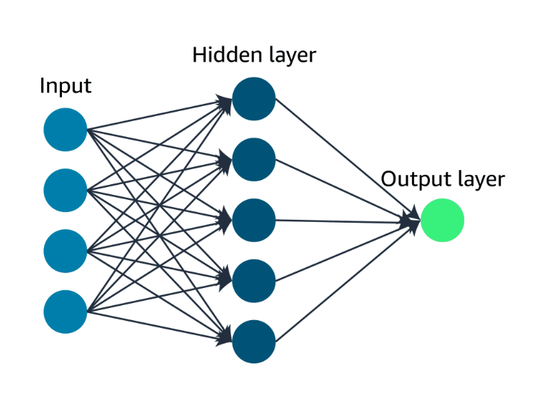

# Deep Learning Fundamentals: Understanding the Brain-Inspired Revolution in AI

Deep learning has emerged as one of the most transformative technologies of the 21st century, powering everything from voice assistants to autonomous vehicles. This revolutionary approach to artificial intelligence draws inspiration from the most complex system we know: the human brain. In this comprehensive guide, we'll explore the fundamentals of deep learning and discover how artificial neural networks are changing the world.

## What is Deep Learning?

Deep learning is a subset of machine learning that uses artificial neural networks with multiple layers (hence "deep") to model and understand complex patterns in data. The field is inspired by the structure and function of the human brain, involving computational models designed to mimic how our brains process information.

Unlike traditional machine learning algorithms that require manual feature engineering, deep learning systems can automatically discover the representations needed for detection or classification from raw data. This capability has made deep learning particularly powerful for tasks involving unstructured data like images, audio, and text.

## The Foundation: Neural Networks

At the core of deep learning are neural networks – computational models that form the building blocks of intelligent systems.

### How Neural Networks Work

Just like our brains have neurons connected to each other through synapses, neural networks consist of interconnected nodes (artificial neurons) organized into layers. These layers include:

- **Input Layer**: Receives the raw data (images, text, numerical values)
- **Hidden Layers**: One or more intermediate layers that process the information
- **Output Layer**: Produces the final prediction or classification

When we show a neural network many examples – such as data about customers who bought certain products or used specific services – it learns to identify patterns by adjusting the connections (weights) between its nodes. It's like the nodes are communicating with each other, gradually figuring out the patterns that distinguish different types of customers.

### The Learning Process

The magic happens during training. The network:

1. **Receives input data** through the input layer
2. **Processes information** as it flows through hidden layers
3. **Makes predictions** at the output layer
4. **Compares predictions** with actual results
5. **Adjusts connections** to improve accuracy
6. **Repeats the process** thousands of times

Once trained, the neural network can examine data from completely new customers it has never seen before and still make accurate predictions about their behavior, preferences, or likelihood to purchase.

## What Makes Deep Learning "Deep"?

The "deep" in deep learning refers to the number of layers in the neural network. While traditional neural networks might have 2-3 layers, deep networks can have dozens or even hundreds of layers. This depth allows them to:

- **Learn hierarchical representations**: Lower layers detect simple features (edges, textures), while higher layers combine these into complex concepts (faces, objects)
- **Capture intricate patterns**: Multiple layers can model non-linear relationships and complex interactions
- **Achieve superior performance**: Deeper networks often outperform shallow ones on complex tasks

## Types of Neural Networks

### Feedforward Neural Networks

The simplest type where information flows in one direction from input to output. These are great for:
- Basic classification tasks
- Regression problems
- Pattern recognition

### Convolutional Neural Networks (CNNs)

Specialized for processing grid-like data such as images. CNNs use:
- **Convolutional layers**: Apply filters to detect features like edges and textures
- **Pooling layers**: Reduce spatial dimensions while preserving important information
- **Fully connected layers**: Make final classifications

### Recurrent Neural Networks (RNNs)

Designed for sequential data with memory capabilities. RNNs excel at:
- Time series prediction
- Natural language processing
- Speech recognition

### Long Short-Term Memory (LSTM) Networks

A special type of RNN that can remember information for long periods, solving the vanishing gradient problem.

### Transformer Networks

The latest breakthrough architecture that uses attention mechanisms to process sequences more efficiently than RNNs.

## Key Applications of Deep Learning

### Computer Vision

Computer vision is a field of artificial intelligence that enables computers to interpret and understand digital images and videos. Deep learning has revolutionized this domain by providing powerful techniques for:

**Image Classification**: Identifying what objects are present in an image
- Medical diagnosis from X-rays and MRIs
- Quality control in manufacturing
- Content moderation on social platforms

**Object Detection**: Locating and identifying multiple objects within an image
- Autonomous vehicle navigation
- Security and surveillance systems
- Retail inventory management

**Image Segmentation**: Identifying which pixels belong to which objects
- Medical imaging for surgical planning
- Satellite image analysis for urban planning
- Augmented reality applications

**Facial Recognition**: Identifying and verifying individuals
- Security systems and access control
- Photo organization and tagging
- Law enforcement and border control

### Natural Language Processing (NLP)

Natural Language Processing is a branch of artificial intelligence that deals with the interaction between computers and human languages. Deep learning has made significant strides in NLP, enabling:

**Text Classification**: Categorizing text into predefined groups
- Email spam detection
- News article categorization
- Document classification

**Sentiment Analysis**: Understanding emotions and opinions in text
- Social media monitoring
- Customer feedback analysis
- Brand reputation management

**Machine Translation**: Converting text from one language to another
- Google Translate and similar services
- Real-time conversation translation
- Global business communication

**Language Generation**: Creating human-like text
- Chatbots and virtual assistants
- Content creation and writing assistance
- Code generation and documentation

**Question Answering**: Understanding and responding to queries
- Search engines
- Customer support systems
- Educational platforms

### Speech Recognition and Generation

- **Speech-to-Text**: Converting spoken words into written text
- **Text-to-Speech**: Generating natural-sounding speech from text
- **Voice Assistants**: Siri, Alexa, Google Assistant

### Recommendation Systems

- **Content Recommendation**: Netflix, YouTube, Spotify
- **Product Recommendation**: Amazon, e-commerce platforms
- **Social Media**: Facebook, Instagram, TikTok content curation

## The Deep Learning Workflow

### 1. Data Collection and Preparation

- **Data Volume**: Deep learning typically requires large datasets
- **Data Quality**: Clean, labeled data is crucial for success
- **Data Augmentation**: Techniques to artificially expand datasets
- **Preprocessing**: Normalizing, resizing, and formatting data

### 2. Architecture Design

- **Choosing the right network type**: CNN for images, RNN for sequences
- **Determining depth**: How many layers to include
- **Setting parameters**: Learning rate, batch size, activation functions

### 3. Training Process

- **Forward Propagation**: Data flows through the network
- **Loss Calculation**: Measuring prediction errors
- **Backpropagation**: Adjusting weights to minimize errors
- **Optimization**: Using algorithms like Adam or SGD

### 4. Evaluation and Validation

- **Performance Metrics**: Accuracy, precision, recall, F1-score
- **Cross-Validation**: Ensuring the model generalizes well
- **Testing**: Evaluating on unseen data

### 5. Deployment and Monitoring

- **Model Serving**: Making predictions on new data
- **Performance Monitoring**: Tracking accuracy over time
- **Model Updates**: Retraining with new data

## Advantages of Deep Learning

### Automatic Feature Learning

Traditional machine learning requires domain experts to manually engineer features. Deep learning automatically discovers the most relevant features from raw data, reducing the need for human intervention.

### Scalability

Deep learning models can improve with more data and computational power. As datasets grow and hardware advances, these models become more powerful and accurate.

### Versatility

The same deep learning principles can be applied across different domains – from computer vision to natural language processing to game playing.

### State-of-the-Art Performance

Deep learning has achieved breakthrough results in numerous fields, often surpassing human-level performance on specific tasks.

## Challenges and Limitations

### Computational Requirements

- **Hardware Intensive**: Requires powerful GPUs or specialized chips
- **Energy Consumption**: Training large models consumes significant electricity
- **Cost**: Expensive infrastructure and cloud computing costs

### Data Requirements

- **Large Datasets**: Often need millions of examples to train effectively
- **Labeled Data**: Supervised learning requires expensive human annotation
- **Data Quality**: Sensitive to noisy or biased data

### Interpretability

- **Black Box Nature**: Difficult to understand how decisions are made
- **Lack of Explainability**: Challenges in regulated industries
- **Debugging Difficulty**: Hard to identify why models fail

### Overfitting

- **Memorization**: Models may memorize training data instead of learning patterns
- **Generalization**: May not perform well on new, unseen data
- **Regularization**: Requires techniques to prevent overfitting

## Tools and Frameworks

### Popular Deep Learning Frameworks

**TensorFlow**: Google's open-source platform
- Comprehensive ecosystem
- Production-ready deployment
- Strong community support

**PyTorch**: Facebook's dynamic neural network library
- Research-friendly
- Intuitive debugging
- Growing industry adoption

**Keras**: High-level API for neural networks
- Beginner-friendly
- Rapid prototyping
- Runs on top of TensorFlow

### Hardware Acceleration

**GPUs**: Graphics Processing Units for parallel computation
**TPUs**: Tensor Processing Units optimized for machine learning
**Cloud Platforms**: AWS, Google Cloud, Microsoft Azure

## The Future of Deep Learning

### Emerging Trends

**Transformer Architecture**: Revolutionizing NLP and expanding to other domains
**Self-Supervised Learning**: Reducing dependence on labeled data
**Edge AI**: Running deep learning models on mobile devices
**Quantum Computing**: Potential for exponential speedups

### Ethical Considerations

**Bias and Fairness**: Ensuring models don't discriminate
**Privacy**: Protecting personal data in training and inference
**Transparency**: Making AI decisions more interpretable
**Accountability**: Determining responsibility for AI decisions

## Getting Started with Deep Learning

### Prerequisites

1. **Mathematics**: Linear algebra, calculus, statistics
2. **Programming**: Python is the most popular language
3. **Machine Learning**: Understanding of basic ML concepts
4. **Data Analysis**: Experience with data manipulation and visualization

### Learning Path

1. **Start with basics**: Understand neural networks and backpropagation
2. **Hands-on practice**: Implement simple networks from scratch
3. **Use frameworks**: Learn TensorFlow or PyTorch
4. **Work on projects**: Apply knowledge to real-world problems
5. **Stay updated**: Follow research papers and industry trends

### Recommended Resources

- **Online Courses**: Coursera, edX, Udacity deep learning specializations
- **Books**: "Deep Learning" by Ian Goodfellow, "Hands-On Machine Learning" by Aurélien Géron
- **Tutorials**: Official framework documentation and tutorials
- **Communities**: Stack Overflow, Reddit, GitHub

## Key Takeaways

Deep learning represents a paradigm shift in artificial intelligence, moving from hand-crafted features to learned representations. Key points to remember:

- **Inspiration from biology**: Neural networks mimic brain structure and function
- **Automatic feature learning**: No need for manual feature engineering
- **Versatile applications**: Success across vision, language, and many other domains
- **Scalable with data**: Performance improves with more data and computation
- **Computational demands**: Requires significant hardware and energy resources
- **Ongoing evolution**: Rapid pace of research and development

Deep learning has already transformed industries and will continue to drive innovation in the coming years. Whether you're a student, researcher, or industry professional, understanding these fundamentals will help you navigate the exciting world of artificial intelligence.

The journey into deep learning is challenging but incredibly rewarding. As you explore this field, remember that the key to success lies in combining theoretical understanding with practical experience. Start with simple projects, gradually tackle more complex problems, and never stop learning – the field of deep learning is constantly evolving, offering endless opportunities for discovery and innovation.